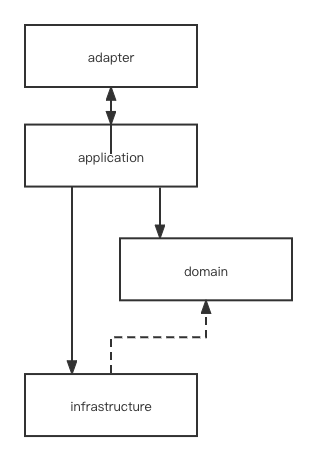
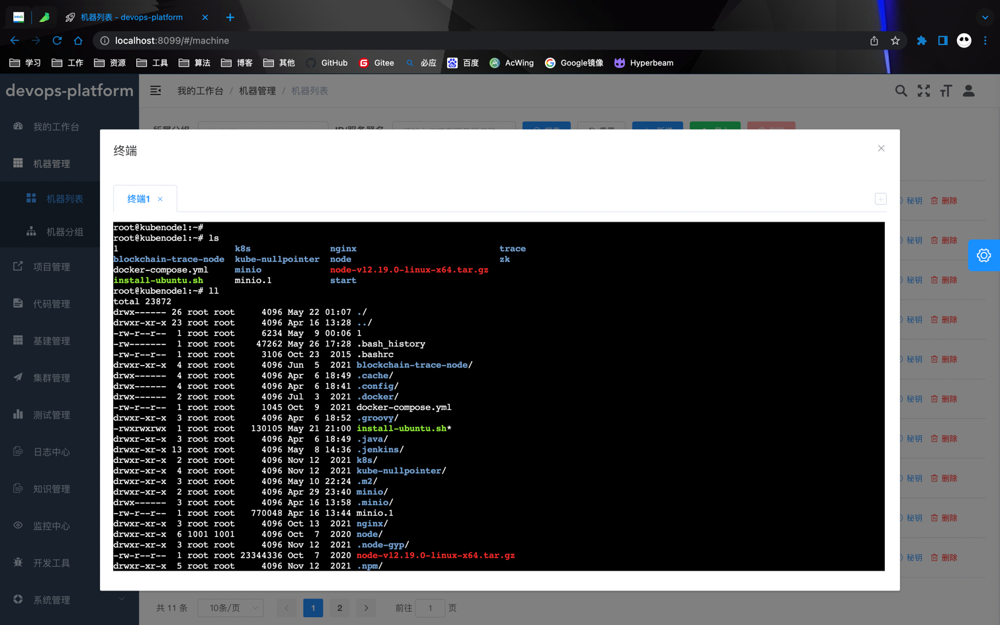
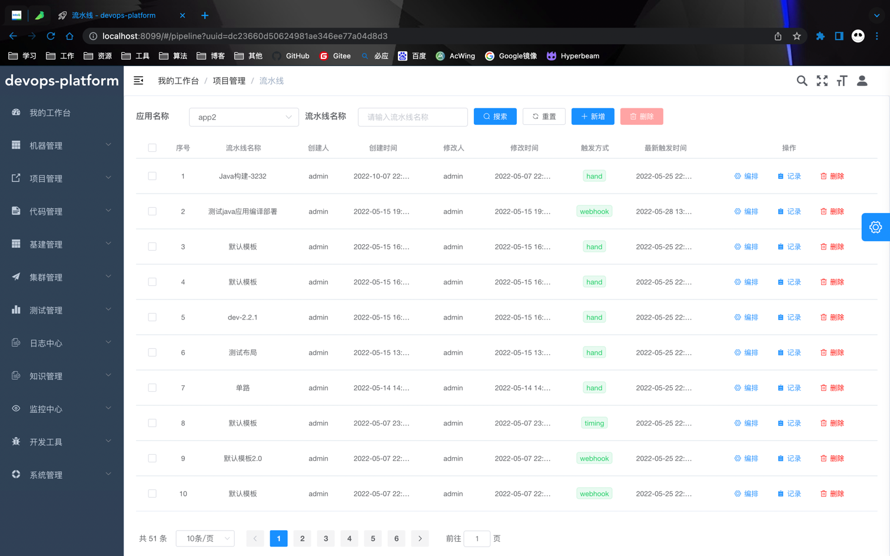
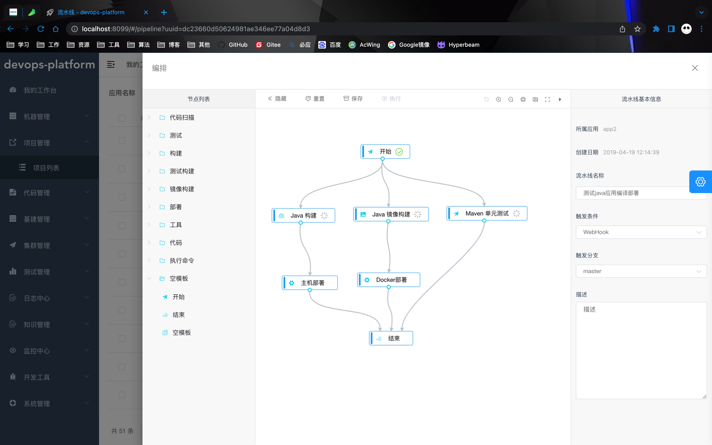
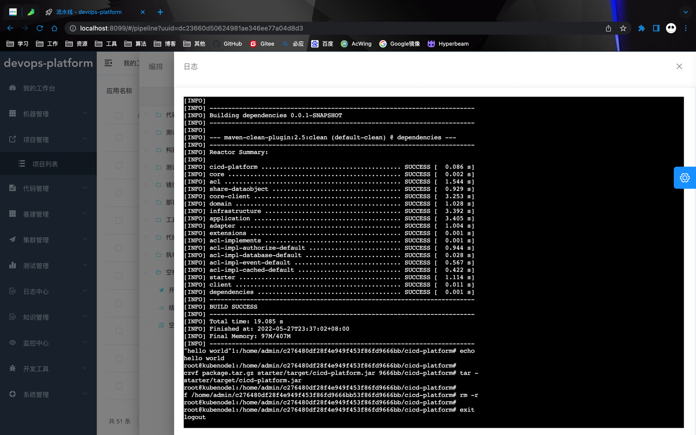
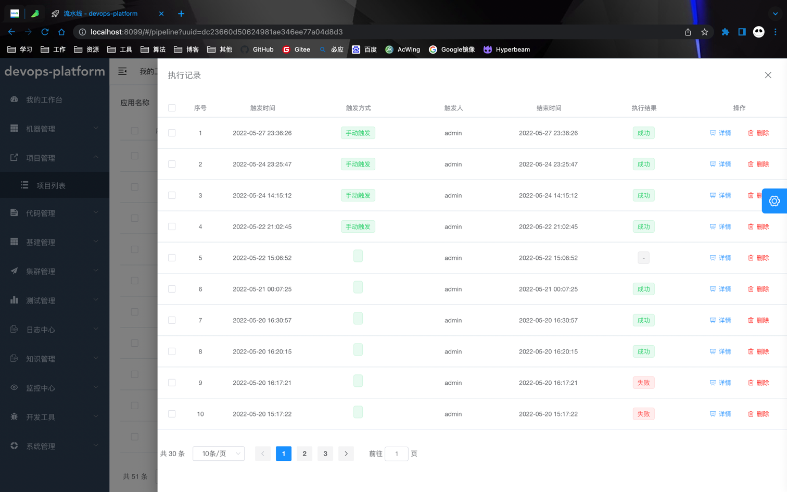
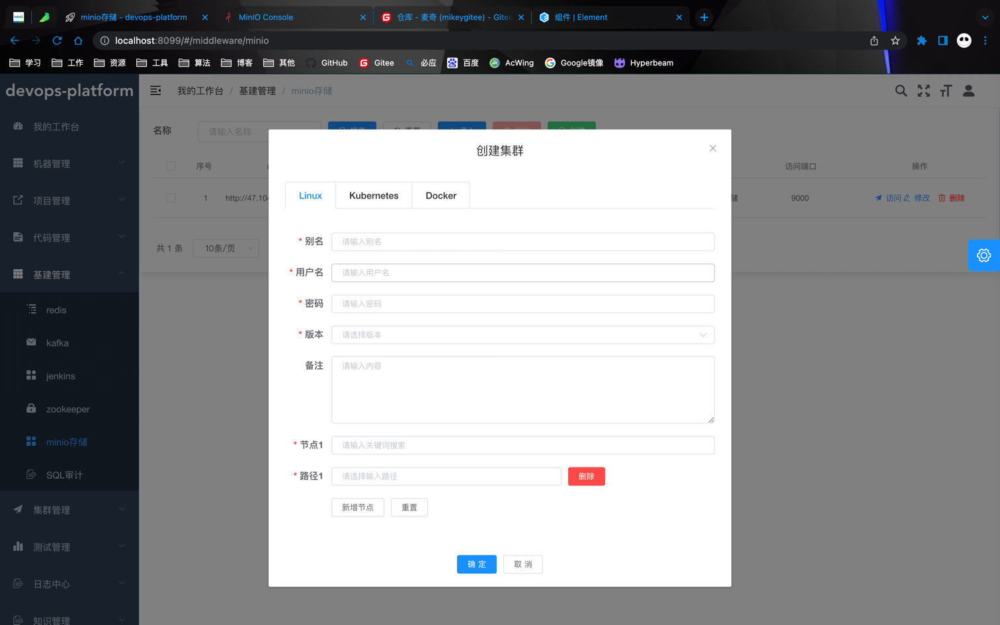
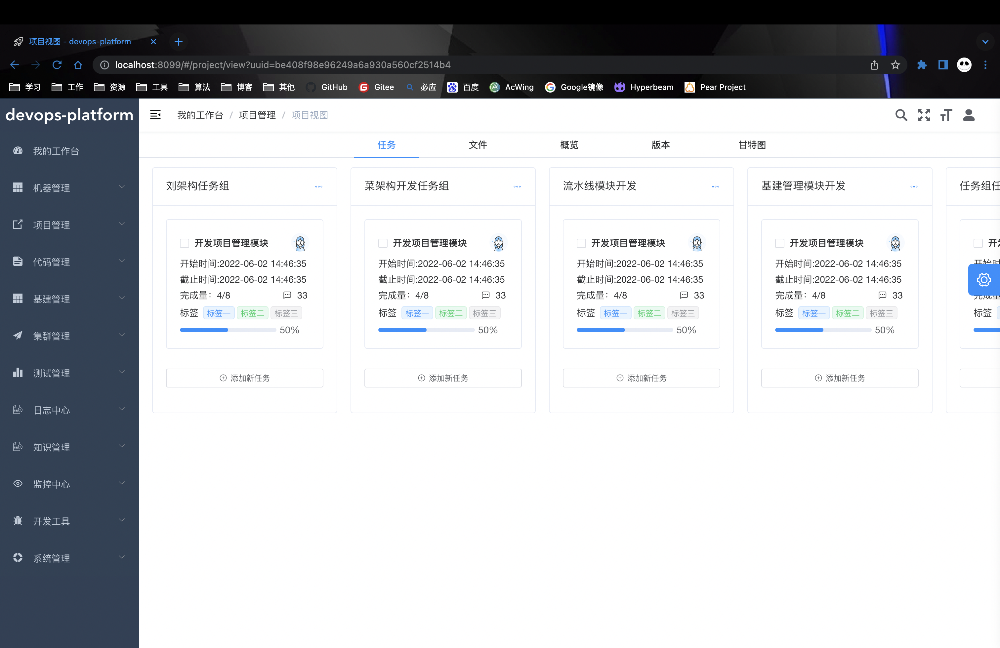

# devops-platform

<p align="center">
  <a href="https://github.com/ken-xue/devops-platform/blob/master/LICENSE">
    
  </a>
  <a href="https://github.com/ken-xue/devops-platform/blob/master/LICENSE">
    
  </a>
  <a href="https://github.com/ken-xue/devops-platform/blob/master/LICENSE">
    
  </a>
  <a href="https://kubernetes.io">
    
  </a>
  <a href="https://github.com/ken-xue/devops-platform/blob/master/LICENSE">
    
  </a>  
  <a href="https://github.com/ken-xue/devops-platform/blob/master/LICENSE">
    
  </a>
  <a href="https://github.com/ken-xue/devops-platform/blob/master/LICENSE">
    
  </a>  
</p>

<p align="center">
<a title="GitHub Watchers" target="_blank" href="https://github.com/ken-xue/devops-platform/watchers"></a>  
  <a title="GitHub Stars" target="_blank" href="https://github.com/ken-xue/devops-platform/stargazers"></a>  
  <a title="GitHub Forks" target="_blank" href="https://github.com/ken-xue/devops-platform/network/members"></a>
</p>

<p align="center"> 中文简体  |  <a title="English" href="README_en.md"> English</a></p>


## 项目简介

> devops-platform 是一款企业级开发、效能、运维平台。打通项目立项、研发、测试、发布、运维等流程，对软件项目开发形成闭环。前后端分离开发[前端项目地址](https://github.com/ken-xue/devops-platform-vue)

## 项目架构



## 快速开始

1.下载代码
```bash
git clone https://github.com/ken-xue/devops-platform.git
```
2.创建数据库
```bash
create database `devops-platform` default charset utf8mb4
```
3.导入SQL脚本
```bash
use `devops-platform`
source /Users/biaoyang/IdeaProjects/devops-platform/doc/script/DDL.sql
```

4.配置对象存储地址

```yaml
# minio访问地址
minio.url=http://192.168.100.21:30001/
# 用户名
minio.accessKey=minioadmin
# 密码
minio.secretKey=minioadmin
# 配置构建服务器
mc config host add minio http://192.168.100.21:30001 minioadmin minioadmin
```

5.编译并运行
```bash
cd devops-platform
mvn clean install
```

6.构建服务器配置环境

- minio客户端mc (需配置好连接服务器)
- maven
- git
- jre

## 项目文档

- [详细设计文档](https://www.yuque.com/docs/share/2a5531ff-f74d-48a5-922a-226c52abd755)

## 相关许可

MIT [LICENSE](./LICENSE)

## 项目图片













