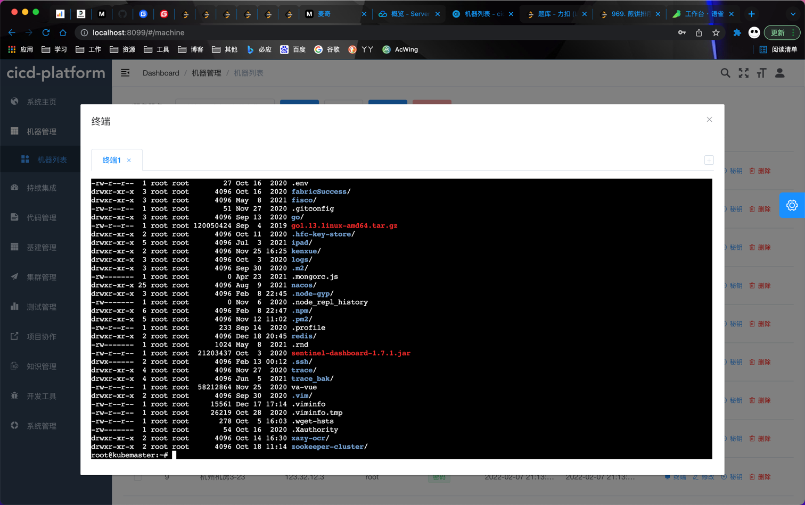
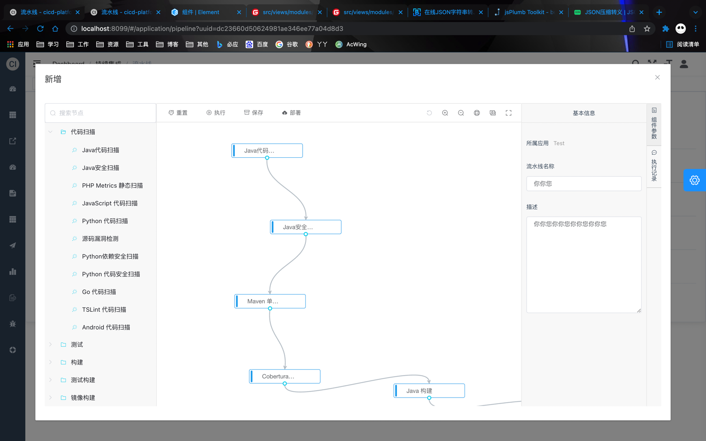
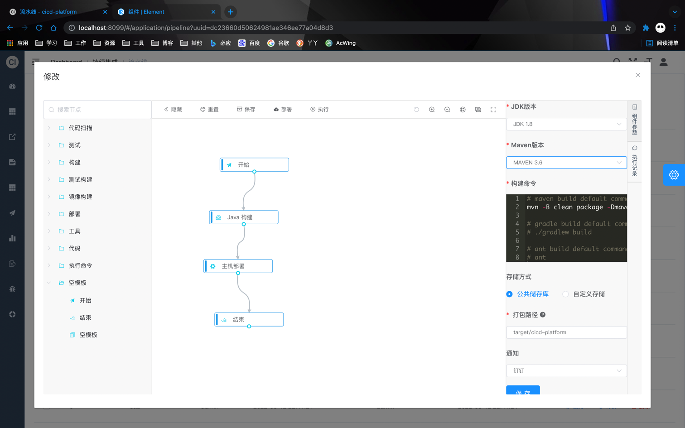

# cicd-platform

<p align="center">
  <a href="https://github.com/ken-xue/cicd-platform/blob/master/LICENSE">
    
  </a>
  <a href="https://github.com/ken-xue/cicd-platform/blob/master/LICENSE">
    
  </a>
  <a href="https://kubernetes.io">
    
  </a>
</p>


## Introduction

> cicd-platform 是一款企业级持续可交付平台。采用前后端分离开发模式([前端地址](https://github.com/ken-xue/cicd-platform-vue))

## Architecture

TODO

## QuickStart

```bash
curl -sSL https://raw.githubusercontent.com/ken-xue/cicd-platform/main/install/install.sh | sh
```

## Document

- [Detail Design Document](https://www.yuque.com/docs/share/2a5531ff-f74d-48a5-922a-226c52abd755)

## License

MIT see [LICENSE](./LICENSE).

## Image



